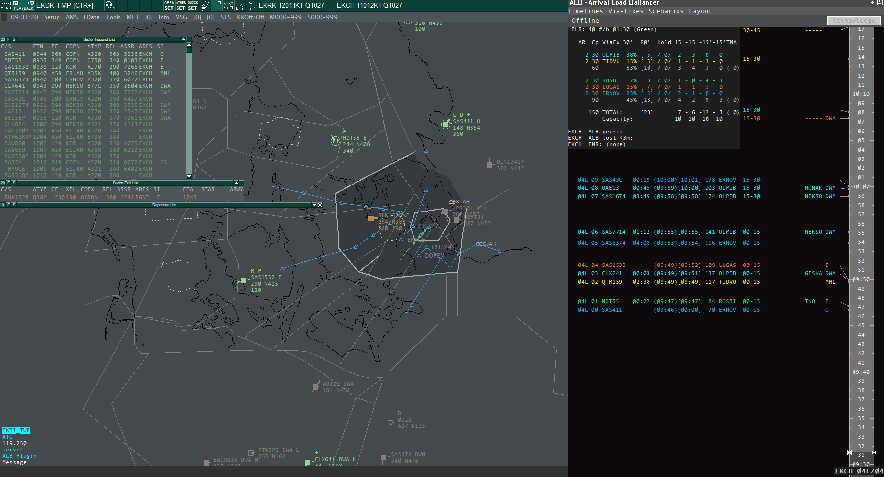

# Arrival Load Ballancer (ALB) - User Guide

Welcome! This site covers installation, quick start, common workflows, and troubleshooting for **ALB**.

The ALB plugin for Euroscope provides a way to
- Get an overview of inbound traffic to the choosen airport(s)
- Operate as Flow Management Responsible (FMR) providing a means of communication with other ALB users for the same airport:
-- Flow rates per inbound fix
-- EAT (Estimated Arrival Time) - **not implemented yet**

- **New user?** Start with [Quick Start](quick-start.md)

- **Installing?** See [Download & Install](download-install.md)

[Open full size](img/Full screenshot ESandALB.png)