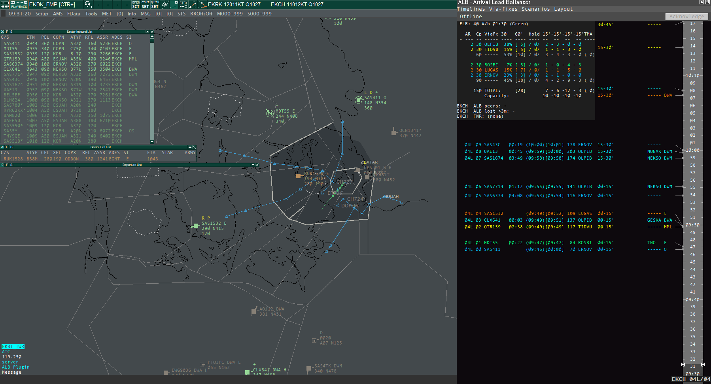

# Arrival Load Balancer (ALB) - User Guide

Welcome! 
This site covers installation, quick start, common workflows, and troubleshooting for **ALB**.

The ALB plugin for Euroscope provides a way to:

- Get an overview of inbound traffic to the chosen airport(s)
- Coordinate arrival planning with other ALB users for the same airport
- Manage flow rates per inbound fix and scenario
- Coordinate hold-related EAT actions for aircraft already in hold

The installed package uses a small loader/runtime split:

- `ALB.dll` is the EuroScope-facing loader
- `ALBCore.dll` is the ALB runtime plugin

EuroScope should load `ALB.dll`.

So to get you started:

- **Installing?** See [Download & Install](download-install.md)

- **New user?** Start with [Quick Start](quick-start.md)

- **Support** Find us on [Discord](https://discord.gg/CH4N7WbT){target="_blank" rel="noopener"}

[Open full size](img/Full screenshot ESandALB.png)
