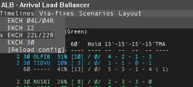
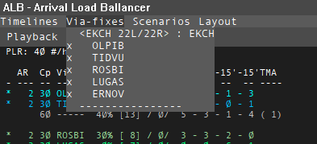
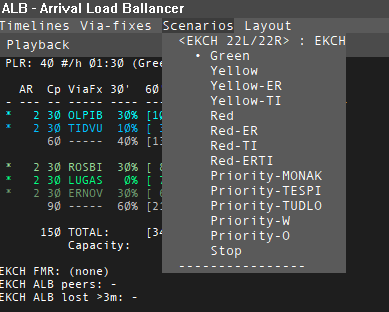
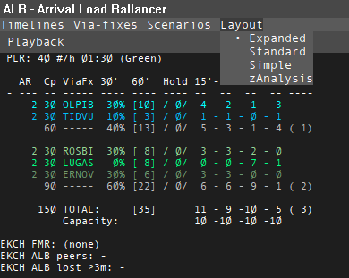

# Buttons & Menus

This page is the quick reference for the controls across the top of the ALB window.

Use these pages for the full operational meaning behind the controls:

- [Planning Modes Overview](planning-modes/index.md)
- [EAT:LT Landing Timeline Planning](planning-modes/eat-lt.md)
- [EAT:AR Arrival Rate Fallback Planning](planning-modes/eat-ar.md)
- [Feeder View vs Runway View](planning-modes/views.md)

## Top buttons

- `EAT` or `PLT`: changes what the compact combi field shows in the aircraft rows. It is a local display toggle and does not change the shared sequence logic.
- `2 EAT`, `2 GL`, `2 SW`, or `2 ---`: local hold-display setup for the compact `glEatCombi` field while an aircraft is still in hold and more than the threshold away from EAT.
- `TXE*` or `TXE-`: controls whether EAT-related policy is transmitted when you are the manual FMR. In normal operations, only the manual FMR can change this.
- `EAT:AR`, `EAT:LT`, and sometimes `EAT:TF`: selects the planning basis used for EAT.
  - `EAT:LT` is the recommended modern operating mode
  - `EAT:AR` is the rougher fallback method
  - `EAT:TF` is a separate target-fix mode when present
- `ETA:ES` or `ETA:ALB`: selects whether the ETA basis follows EuroScope or the ALB calculation.
- `HLW*` or `HLW-`: is the active local permission for this ALB instance to write accepted hold timing back to the TopSky holding list.

Current UI note:

- recent ALB builds hide the visible `FPC` top-row button even though the underlying `FPC` state, peer sync, and logging behavior still exist

## Local display buttons

The compact display buttons are local to your client. They do not change shared
planning policy.

For the hold-display button:

- the number is the minutes before EAT where the display switches to countdown
- `EAT` means show EAT before that threshold
- `GL` means show gain or lose before that threshold
- `SW` means alternate gain or lose and EAT before that threshold
- `---` means stay blank before that threshold

Mouse actions:

- left-click decreases the threshold by 1 minute
- right-click increases the threshold by 1 minute
- double-click cycles the pre-threshold display mode

Example:

- `2 GL` means show gain or lose while the aircraft is in hold and more than 2
  minutes from EAT, then switch to countdown inside 2 minutes

## Hold / EAT controls

- `HLW` is the active operator-facing local write gate for `HOLD_EAT`.
- `HLS` is retained only as legacy or compatibility state and is no longer a normal visible top-row control.
- In backend-primary healthy operation, canonical per-aircraft EAT comes from backend `SEQ/SET2+AC`.
- The final `/HOLD_EAT/HHMM/` write is only the aircraft-visible local side effect of that canonical authority path.
- `SEAT` remains available only as legacy, fallback, or compatibility hold-EAT handling. It is not the normal backend-primary transport.

## Who can change these buttons

- `EAT` or `PLT` is local display only
- the hold-display button such as `2 EAT` or `2 GL` is local display only
- `TXE` is restricted to the manual FMR
- `Layout`, `Timelines`, and via-fix visibility are local display controls
- `EAT:AR` / `EAT:LT` / `EAT:TF`, `ETA:ES` / `ETA:ALB`, legacy `HLS`
  preference state, and underlying `FPC` shared state are shared-planning
  controls and should normally be changed by the controller currently
  responsible for the shared plan
- `HLW` is the active local write permission for the final local `HOLD_EAT` publication side effect
- `PLR` is a shared planning control
- `AR` is a shared planning control when the older `EAT:AR` method is being used

When a manual FMR is active, ALB now enforces that more directly for several
shared controls. Non-FMR peers should expect shared `PLR`, `AR`, and scenario
edits to be ignored locally instead of quietly creating a competing plan.

See [Collaboration & FMR](collaboration-fmr.md) for the authority rules behind that.

## ETA and ELT naming

The top button uses `ETA:ES` and `ETA:ALB`, while some layouts may show row fields called `ELT`, `ELT-ES`, or `ELT-ALB`.

- `ETA:ES` or `ELT-ES` means the EuroScope or live estimate branch
- `ETA:ALB` or `ELT-ALB` means the ALB-calculated or corrected estimate branch

When `ETA:ALB` or `ELT-ALB` is selected, the ALB branch may use the configured orange timing model before terminal or post-via phases. Orange timing is ALB's configured route or STAR track-mile estimate toward touchdown. It is part of the ALB scheduling estimate, not a separate controller action.

Operator-facing rule of thumb:

- before the aircraft is deep into terminal or post-via handling, ALB can use its own corrected branch to give a more useful planning estimate
- that branch is built from the via-fix timing anchor plus configured orange distance-to-land, then turned into seconds using an ALB descent-speed model
- the current model uses a rough higher segment, a TMA segment, and a final segment; when flight-plan performance and upper-wind data are available, ALB can refine that estimate further
- once the aircraft is in terminal or post-via phases, ALB stops forcing a separate corrected landing estimate and follows the live EuroScope branch where appropriate
- peers should normally follow the FMR's selected ETA policy

For the detailed configuration side of that timing model, see
[Config File Reference](../config/config-description.md#viafix_track_nm_orange).

## Dropdown menus

### Timelines

Chooses which timeline definitions are active.

- You can select one or more timelines
- Timelines come from the ALB config
- They define destination airport coverage, streams, retained legacy scenario definitions, and default layout behavior

### Via-fixes

Lets you focus on the streams you care about.

- In some layouts, deselected streams remain visible but are dimmed
- In other layouts, deselected streams are hidden entirely
- The exact behavior depends on the selected layout and its `hideDeselectedViaFixes` setting

See [Feeder View vs Runway View](planning-modes/views.md) for what that means operationally.

### Scenarios

Recent ALB builds hide the visible `Scenarios` menu from the normal control
bar.

Operationally:

- It exists for compatibility and history
- It is not part of the recommended current operating method
- internal scenario config and apply logic still exist for compatibility
- In normal modern ALB use, the FMR works mainly through `EAT:LT` monitoring and correction instead of scenario switching

See [Retired: Scenarios](retired/scenarios.md).

### Peers

Shows an informational list of ALB peers for the active airport or airports.

- This menu is for awareness, not for actions
- It is the quick way to see whether another ALB instance is already coordinating the plan
- in current simplified control-bar layouts, `Peers` appears immediately after `Layout`
- It can also show the peer's current EAT policy and ETA branch context in a compact form

### Layout

Changes how each aircraft row is displayed.

- Layouts come from config
- A layout can make ALB feel feeder-oriented or runway-oriented
- That view choice is independent of `EAT:AR` versus `EAT:LT`
- The available choices depend on the loaded config

See [Feeder View vs Runway View](planning-modes/views.md) for how layout changes the meaning of ordering and sequence actions.

## Stats-area click actions

- `PLR`: left-click decreases planned landing rate by 1. Right-click increases it by 1.
- `AR`: left-click decreases the stream interval by 1 minute. Right-click increases it by 1.

In `EAT:LT`, AR is not the active planning driver. Visible AR values are legacy/context information, and AR adjustment is not the normal control method.

For the operational difference between `PLR` and `AR`, see [EAT:LT Landing Timeline Planning](planning-modes/eat-lt.md) and [EAT:AR Arrival Rate Fallback Planning](planning-modes/eat-ar.md).
