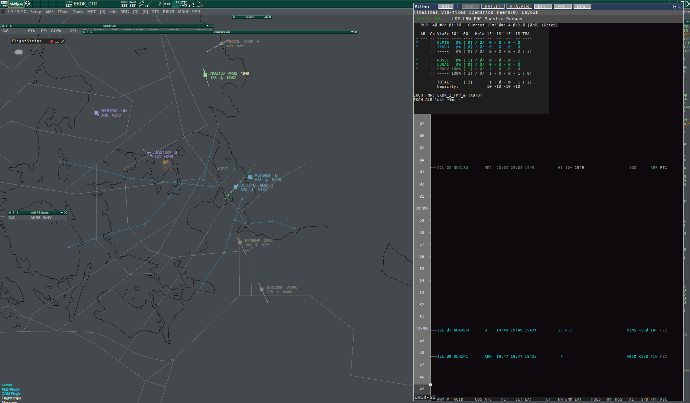
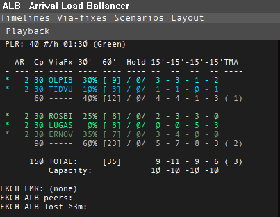

# Interface

Some screenshots in this guide were taken on an older ALB release. They still show the same main areas, but small label or spacing details may differ.

## Main window

ALB is built around four working areas:

1. The top button row for quick policy and display toggles
2. The menu row for timelines, via-fixes, layout, peers, and older retained legacy surfaces
3. The stats and arrival-planning block at the top left
4. The timeline area containing the aircraft rows

[Open full size](../img/Full-screenshot-ESandALB.png)

## Stats and arrival-planning block

The planning block overlaps the upper-left part of the timeline area.

The top line contains the airport-wide landing plan:

- `PLR` is the planned landing rate
- the actual landing figure shows recent achieved landing rate
- the missed figure shows recent missed-approach activity

Each via-fix line then shows the stream-specific planning picture:

- `AR`: current minutes between releases for that stream
- `Cp`: capacity implied by the current AR
- the via-fix name
- near-term demand distribution
- number of aircraft in hold
- 15-minute buckets
- TMA count

Lines showing `-----` are separators or subtotal breaks from the configured timeline definition.

## What is clickable here

- Left-click `PLR` to decrease the planned landing rate by 1
- Right-click `PLR` to increase the planned landing rate by 1
- Left-click a stream `AR` to decrease the interval by 1 minute
- Right-click a stream `AR` to increase the interval by 1 minute

In `EAT:LT`, AR is not the active planning driver. Visible AR values are legacy/context information, and AR adjustment is not the normal control method.

## Timeline area

The timeline rows are the operational center of ALB.

- Left-click an aircraft row to select it
- When possible, that selection follows EuroScope ASEL behavior
- If you select an aircraft elsewhere and it is relevant to the active timelines, ALB can highlight it in the list
- Right-click an aircraft row to open the aircraft action menu
- Whether ordering and sequence actions are stream-relative or global depends on the current feeder or runway layout

See [Aircraft Actions](aircraft-actions.md) for the right-click behavior.
See [Feeder View vs Runway View](planning-modes/views.md) for the layout-specific meaning.

## Combi field scope

Some layouts include the compact `glEatCombi` field.

Practical rule:

- ALB only shows Combi output for aircraft that belong to traffic covered by a
  currently active ALB timeline
- in practice that means the aircraft destination must be part of an active
  timeline's `destinationAirports`
- unrelated traffic outside the active ALB timeline scope is now left blank
  instead of showing a configured empty Gain/Lose placeholder

If you want Combi to appear for a destination, activate the matching timeline.
If you want a visible placeholder when Gain/Lose is selected but empty, use
`glEatCombiDisplay.gainLooseEmptyText` in the config.

## ELT and ETA in the display

Some layouts show landing-time style labels such as `ELT`, `ELT-ES`, or `ELT-ALB`.

- `ELT` means estimated landing time
- `ELT-ES` is the live EuroScope-style branch
- `ELT-ALB` is the ALB-corrected branch when that branch is relevant

`ELT-ALB` may include ALB's configured orange timing before the aircraft is deep into terminal handling. In ALB documentation, orange timing means the configured route or STAR-based track miles from the via-fix or holding-fix area toward touchdown. It is a planning estimate used while the aircraft is still far enough out that route-based timing is useful.

At a practical level, ALB builds that estimate from the via-fix timing anchor
plus a configured orange distance-to-land. It then converts that distance into
time with a three-part descent model:

- a higher-distance segment that assumes faster descent speeds
- a TMA segment for the next part of the arrival
- a final segment close to landing

The current baseline is roughly jet-like:

- about `250 KIAS` in the higher segment
- about `180 KIAS` in the TMA segment
- about `145 KIAS` on the final segment

When flight-plan performance data is available, ALB can refine those segment
speeds for the specific aircraft. When upper-wind data is available, ALB can
also let that wind shift the ground-speed side of the estimate.

Once the aircraft is inside terminal or post-via handling, ALB should not keep inventing a separate orange-based landing estimate. At that point the live EuroScope-style branch is normally the safer basis.

The top-row `ETA:ES` or `ETA:ALB` button controls which estimate branch ALB uses where that policy applies.

For the full config and tuning details, see
[Config File Reference](../config/config-description.md#viafix_track_nm_orange).

## Status line and peer awareness

The lower information area is used for ALB status text. It is where mode and communication health feedback appears, while the `Peers` menu gives you a compact airport-by-airport view of who else is connected.

In current ALB builds, the `Peers` view may also summarize the peer's EAT
policy and ETA branch context in a compact form. It remains an informational
surface, not the place where you change authority.

In current simplified control-bar layouts, `Peers` appears immediately after
`Layout`.

## Next pages

- [Planning Modes Overview](planning-modes/index.md)
- [Feeder View vs Runway View](planning-modes/views.md)
- [Buttons & Menus](buttons-and-menus.md)
- [Aircraft Actions](aircraft-actions.md)
