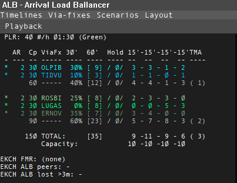
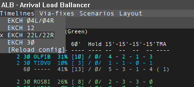
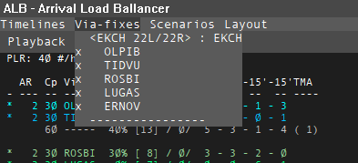
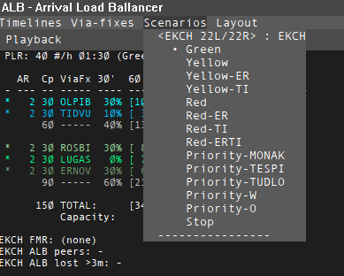
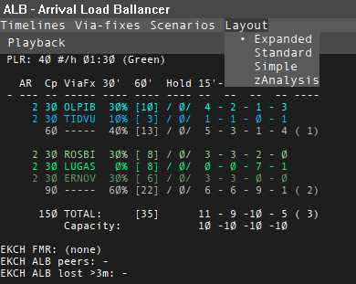

# User Interface

**Images taken from version 0.2.7**

The user interface essentially consists of two different areas:

1. The Timeline showing inbound aircraft to the airports as defined for the selected Timeline(s).

2. The inbound statistics for the same airports

The data TO build the timelines and statistics is defined in the config file (see [Config File Description](../config/config-description.md) ).

## Main window

The total view can be seen below. The window will be on top. It can be moved to a secondary screen independantly of Euroscope.

[Open full size](../img/Full screenshot ESandALB.png)

## Arrival statistics

The statistics area is presented in the top left and will overlap the upper part of the timeline.

For each ViaFix the following is displayed:

- AR: Arrival Rate (minuts between each release)
- Cp: Capacity (60 min / AR)
- ViaFx: The Inbound fix in question (typically the holding fix)
- 30': The PERCENTAGE distribution of the aircraft arriving within the first 30 mints (excl. aircraft in the TMA)
- 60': The NUMBER of aircraft arriving within the next 60 mints
- Hold: The NUMBER of aircraft cleared in hold
- 15': 4 intervals of 15 minuts with the NUMBER of aircraft in the given interval (0-15, 15-30, 30-45, 45-60)
- TMA: The NUMBER of aircraft in the TMA

ViaFix lines with ------ are subtotals.

The TOTAL line should be self explanatory.

The Capacity line is based on the Planned Arrival Rate shown on the top line. Eg. 40 arrivals per hour leads to 10 each 15 mints.

## Drop down menues
You adjust the plugin via the drop down menues.

### Timelines

You can select one or more timelines.
A timeline is based on Final Approach Fix(es) with a one or more associated ViaFixes.

### ViaFixes

You can dim all aircraft for ViaFixes not of interest via the menu:

### Scenarios

You can update all Arrival Rates at once by clicking one of the predefined scenarios.

### Layout of aircraft lines

You can choose between defined layouts of the timeline (data per aircraft) as defined in the config file:

## Other manipulation of the User interface
- You can left/right click on the Arrival Rate (AR) for a given ViaFix - to decrease /increase the rate by one minut. (min 1, max 20)
- You can click on an aircraft in the list and ASEL of Euroscope will update accordingly. You can use this for eg. the .point command
- You can click on an aircraft in any list in TopSky or on Euroscope and a box will surround the aircraft if it is relevant and on the timeline.